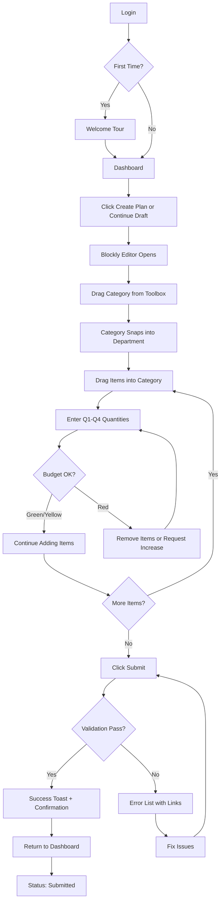
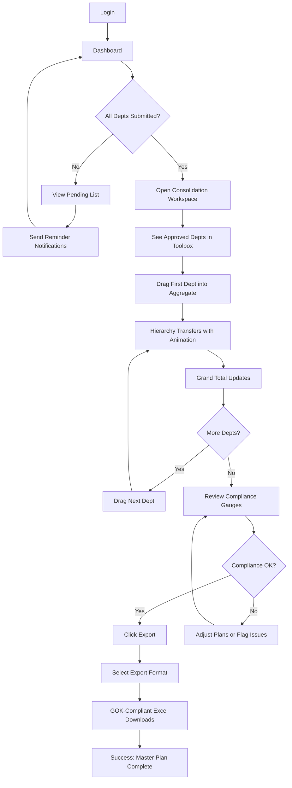
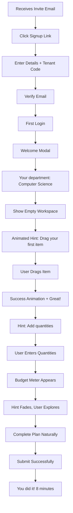
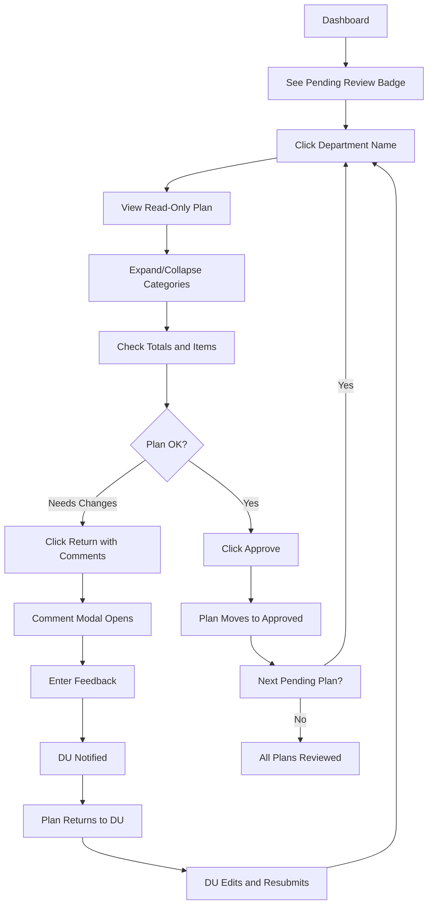

# UX Design Specification Procureline

**Author:** Tyroon
**Date:** 2026-01-19

---

## Executive Summary

### Project Vision

Procureline is a multi-tenant SaaS platform transforming procurement management for Kenyan universities through a breakthrough **visual Blockly-based interface**. The platform replaces complex Excel spreadsheets with intuitive drag-and-drop blocks representing hierarchical procurement data (Department → Category → Item), enabling:

- **60% faster plan creation** through visual block manipulation
- **80% fewer data entry errors** via real-time validation
- **Procurement cycles reduced from 4-6 weeks to 1-2 weeks** through instant consolidation

The platform addresses a critical gap where 80%+ of institutions still rely on manual, Excel-based procurement systems that create operational chaos, compliance risks, and massive time waste.

**Unique Value Proposition:**
- Only procurement platform using visual block programming for hierarchical data
- Zero-training interface - users complete plans without reading documentation
- GOK compliance (AGPO 30%, PWD 2%, Local Content 40%) calculated automatically
- Bidirectional Excel integration preserves existing workflows

### Target Users

#### Primary Users

| Role | Persona | Context | Tech Level | Key Need |
|------|---------|---------|------------|----------|
| **Procurement Officer (PO)** | Sarah Wanjiku, Chief PO | Manages 7+ departments, drowning in Excel chaos, spends 40%+ time on manual consolidation | Intermediate | Fast consolidation, compliance automation, single source of truth |
| **Departmental User (DU)** | Michael Otieno, Dept Head | Sees procurement as "nuisance admin work," no procurement training, wants to finish quickly | Low-Intermediate | 10-minute completion, zero training required, impossible to mess up |

#### Secondary Users

| Role | Persona | Context | Tech Level | Key Need |
|------|---------|---------|------------|----------|
| **Tenant Admin** | Dr. Amina Hassan, DVC Administration | Oversees procurement compliance, reports to University Council | Intermediate | Real-time visibility dashboards, institutional reporting, PO management |
| **Platform Admin** | Kevin Njoroge, DevOps Engineer | Manages 47+ university tenants, ensures system health and security | High | System health monitoring, tenant management, security compliance |

#### User "Aha!" Moments

- **PO:** First consolidated plan exported in hours instead of weeks
- **DU:** Completing a valid procurement plan in 10 minutes with zero training
- **Both:** Real-time budget meters showing exactly where they stand

### Key Design Challenges

| Challenge | Description | Priority |
|-----------|-------------|----------|
| **Blockly Complexity Management** | Workspaces can become visually overwhelming with 10+ departments × 15+ categories × 100+ items. Requires progressive disclosure, collapsible blocks, and clear visual hierarchy. | Critical |
| **Zero-Training Interface** | DUs have no procurement knowledge and see this as a "nuisance task." Interface must be instantly intuitive - if they need to read docs, we've failed. | Critical |
| **Multi-Role Dashboard Design** | 4 distinct user roles need different Bento box dashboards with role-appropriate information density and actions. | High |
| **Real-Time Feedback Systems** | Budget meters, validation warnings, compliance indicators must be visible but not overwhelming during block manipulation. | High |
| **Mobile Limitations** | Blockly is desktop-first - need graceful mobile fallback for approvals/viewing without full editing capability. | Medium |

### Design Opportunities

| Opportunity | Description | Competitive Advantage |
|-------------|-------------|----------------------|
| **Bento Box Information Architecture** | Modern grid-based dashboards with clear visual hierarchy - each "box" tells a story at a glance | Professional, modern feel vs. cluttered ERP interfaces |
| **Gamified Progress Indicators** | Budget meters, submission progress, compliance gauges that animate and celebrate completion | Transforms "nuisance task" into satisfying experience |
| **Color-Coded Block System** | Green theme + Blockly color coding creates intuitive visual language (225 blue-purple departments, 195 teal categories, 160 green items) | Zero-learning visual hierarchy |
| **Contextual Micro-Interactions** | Toast notifications, hover states, inline validation that guide without interrupting | Delightful professional experience |
| **Dark Mode for Power Users** | POs doing consolidation work benefit from dark mode to reduce eye strain during extended sessions | Power user retention |

### Visual Design Direction

**Theme:** Procureline Green Theme (tweakcn)
- **Source:** `pnpm dlx shadcn@latest add https://tweakcn.com/r/themes/cmfptwtsz000o04l18powb22i`
- **Primary Color:** `#18b969` (vibrant green) - conveys trust and growth
- **Design System:** shadcn/ui + Tailwind CSS
- **Border Radius:** `0.5rem` - contemporary rounded corners
- **Typography:** Inter (sans-serif), Fira Code (monospace)

**Dashboard Style:** Bento Box Grid Layout
- Information-dense yet scannable
- Each grid cell serves a specific purpose
- Progressive disclosure through expandable cards
- Consistent spacing and alignment

**Color Palette Application:**
| Element | Light Mode | Dark Mode |
|---------|------------|-----------|
| Primary Actions | `#18b969` | `#48BB78` |
| Background | `#F7FAFC` | `#1A202C` |
| Foreground Text | `#2D3748` | `#E2E8F0` |
| Destructive/Errors | `#E53E3E` | `#E53E3E` |
| Success States | Green primary | Green primary |

---

## Core User Experience

### Defining Experience

The core experience of Procureline is defined by **visual block manipulation** that makes hierarchical procurement data tangible and effortless to manage. Each user role has a distinct core action that defines their experience:

| Role | Core Action | Success Metric |
|------|-------------|----------------|
| **Departmental User (DU)** | Drag items into plan + set quarterly quantities | Plan completed in under 10 minutes |
| **Procurement Officer (PO)** | Drag approved department blocks into consolidation workspace | Consolidation completed in hours, not weeks |
| **Tenant Admin** | Scan Bento box dashboard for institutional status | Answer "where do we stand?" in under 5 seconds |
| **Platform Admin** | Monitor system health + manage tenant lifecycle | Proactive issue detection before user impact |

**The Critical Interaction:** The Blockly drag-and-drop experience is the make-or-break interaction. If block manipulation feels clunky, slow, or confusing, the entire value proposition collapses. Every UX decision should protect and enhance this core interaction.

### Platform Strategy

| Aspect | Decision | Rationale |
|--------|----------|-----------|
| **Primary Platform** | Desktop Web (Next.js 14+) | Blockly manipulation requires mouse precision; PO consolidation is intensive desktop work |
| **Input Method** | Mouse/keyboard primary | Drag-and-drop blocks, quantity number inputs, keyboard navigation |
| **Mobile Strategy** | View-only + approvals | DUs may check submission status on mobile; no block editing on touch devices |
| **Offline Capability** | Not required (MVP) | Real-time Convex sync is a core feature; offline adds complexity without clear value |
| **Browser Support** | Chrome/Edge primary | Blockly optimization target; progressive enhancement for Firefox/Safari |
| **Responsive Breakpoints** | Desktop-first (1280px+), tablet degraded (768px), mobile minimal (320px) | Blockly requires screen real estate |

### Effortless Interactions

These interactions must feel **magical** - zero friction, instant feedback:

| Interaction | Effortless Behavior | Eliminated Pain |
|-------------|---------------------|-----------------|
| **Block Nesting** | Drag category into department slot → snaps automatically with visual confirmation | No manual row/column management like Excel |
| **Budget Tracking** | Real-time meter animates as items are added → color shifts yellow → red as limit approaches | No formula maintenance, no manual calculation |
| **Compliance Calculation** | AGPO/PWD/Local Content percentages update instantly in consolidation view | Eliminated manual percentage calculations |
| **Plan Submission** | Single click → instant validation → confirmation toast with reference number | No email attachments, no version confusion |
| **Consolidation** | Drag approved department blocks into aggregate → grand totals cascade automatically | Eliminated weeks of copy-paste consolidation |
| **Dashboard Scanning** | Bento boxes answer key questions at a glance → drill-down on click | No hunting through scattered Excel files |
| **Error Prevention** | Over-budget blocks pulse red + submission blocked → can't submit broken plans | Eliminated downstream error correction |

### Critical Success Moments

These are the moments that determine whether users become advocates or abandon the platform:

| Moment | Trigger | User Realization | Emotional Peak |
|--------|---------|------------------|----------------|
| **DU First Block Drop** | First item block snaps into category, total updates | "Oh, this actually works intuitively" | Relief + Curiosity |
| **DU Budget Warning** | Meter turns yellow/red as allocation approaches limit | "I literally cannot mess this up" | Confidence |
| **DU Submission Success** | One-click submit → validation passes → confirmation appears | "Done in 10 minutes. That's it?" | Satisfaction + Surprise |
| **PO Dashboard View** | Sees 12/12 departments submitted with zero follow-up needed | "No more chasing email attachments" | Relief + Control |
| **PO Consolidation Magic** | Drags first department into aggregate → sees grand total appear | "This is actually magic" | Delight + Amazement |
| **PO Export Complete** | GOK-compliant Excel downloads in seconds | "I'm going home on time" | Joy + Validation |
| **Tenant Admin Visibility** | Bento dashboard shows status, budget, compliance at a glance | "Finally, I can see what's happening" | Empowerment |

### Experience Principles

These six principles guide every UX decision in Procureline:

| # | Principle | Definition | Application |
|---|-----------|------------|-------------|
| **1** | **Hierarchy is Visible** | The block nesting (Department → Category → Item) makes data structure obvious and directly manipulable | Color-coded blocks, indentation, visual containment |
| **2** | **Impossible to Break** | Real-time validation, budget guards, and smart constraints prevent errors before they happen | Blocked submissions, warning colors, disabled states |
| **3** | **Progressive Disclosure** | Start simple with collapsed blocks; reveal detail on demand through expand/collapse | Collapsible block details, expandable Bento cards, drill-down navigation |
| **4** | **Instant Feedback** | Every user action receives immediate visual response within 200ms | Animations, color transitions, toast notifications, loading states |
| **5** | **Bento Box Clarity** | Dashboards use grid layouts where each cell answers one specific question | Single-purpose cards, clear labels, scannable metrics |
| **6** | **Zero Training Required** | If a user needs to read documentation to complete their primary task, the design has failed | Intuitive iconography, inline hints, contextual guidance |

---

## Desired Emotional Response

### Primary Emotional Goals

The core emotional transformation Procureline delivers is **Empowerment through Simplicity** - complex procurement data becomes visually manageable and instantly understandable.

| Role | Current State | Desired State | Transformation |
|------|--------------|---------------|----------------|
| **Departmental User (DU)** | "Ugh, procurement again" (Dread, Annoyance) | "That was easy!" (Relief, Satisfaction) | Nuisance → Done |
| **Procurement Officer (PO)** | "Drowning in spreadsheets" (Overwhelm, Anxiety) | "I'm in control" (Confidence, Empowerment) | Chaos → Control |
| **Tenant Admin** | "What's actually happening?" (Uncertainty, Frustration) | "I can see everything" (Clarity, Assurance) | Blind → Informed |
| **Platform Admin** | "Is everything running?" (Vigilance, Concern) | "All systems healthy" (Calm, Confidence) | Reactive → Proactive |

### Emotional Journey Mapping

| Stage | DU Emotion | PO Emotion | Design Implication |
|-------|------------|------------|-------------------|
| **First Discovery** | Skeptical curiosity → "This looks different" | Hopeful caution → "Could this actually work?" | Clean onboarding, immediate value demonstration |
| **First Action** | Pleasant surprise → "That was easy!" | Relief → "It actually works!" | Instant feedback, satisfying animations |
| **Core Experience** | Flow state → "Just dragging blocks" | Control → "I can see everything at once" | Minimal friction, clear visual hierarchy |
| **Task Completion** | Accomplishment → "Done in 10 minutes!" | Pride → "Consolidated in hours, not weeks" | Celebration moments, clear confirmation |
| **Error States** | Protected → "Can't submit broken data" | Guided → "Shows me exactly what's wrong" | Helpful error messages, recovery paths |
| **Return Visit** | Familiarity → "I know how this works" | Efficiency → "Let's get this done" | Persistent state, smart defaults |

### Micro-Emotions

**Emotions to Cultivate:**

| Emotion | Priority | Why It Matters | Design Approach |
|---------|----------|----------------|-----------------|
| **Confidence** | Critical | Users must trust their actions won't break things | Clear affordances, undo support, validation feedback |
| **Accomplishment** | Critical | Transforms "nuisance task" into satisfying completion | Progress indicators, celebration moments, clear "done" states |
| **Control** | High | POs need to feel they're managing, not drowning | Dashboard overview, filtering, sorting, search |
| **Trust** | High | Financial data requires assurance of accuracy | Visible calculations, audit trails, confirmation dialogs |
| **Delight** | Medium | Unexpected moments create advocacy | Smooth animations, micro-interactions, "magic" moments |
| **Calm** | Medium | Reduce anxiety around compliance/deadlines | Clear status indicators, deadline visibility, guided flows |

**Emotions to Prevent:**

| Emotion | Risk Scenario | Prevention Strategy |
|---------|--------------|---------------------|
| **Confusion** | Complex Blockly workspace | Progressive disclosure, collapsible blocks, clear visual hierarchy |
| **Anxiety** | Budget exceeded, deadline approaching | Early warnings (yellow before red), clear guidance on resolution |
| **Frustration** | Lost work, unexpected errors | Auto-save, undo support, clear error messages with solutions |
| **Overwhelm** | Too many options, dense interfaces | Bento box clarity, role-appropriate views, focused workflows |
| **Distrust** | "Did that save?" "Is this number right?" | Visible save indicators, transparent calculations, audit trails |

### Design Implications

| Desired Emotion | UX Design Approach |
|-----------------|-------------------|
| **Confidence** | Clear button states, confirmation dialogs for destructive actions, visible validation checkmarks |
| **Accomplishment** | Progress bars, animated checkmarks, completion celebrations, summary screens |
| **Control** | Filtering, sorting, search, customizable dashboard views, keyboard shortcuts for power users |
| **Trust** | Visible calculation breakdowns, "last saved" timestamps, audit history access links |
| **Delight** | Block snap animations (satisfying click), success confetti on major milestones, smooth page transitions |
| **Calm** | Generous whitespace, muted colors for non-critical info, clear deadline countdowns with adequate warning |

### Emotional Design Principles

| # | Principle | Application |
|---|-----------|-------------|
| **1** | **Celebrate Completion** | Every successful action gets positive reinforcement - from subtle animations to milestone celebrations |
| **2** | **Warn, Don't Block** | Show users they're approaching limits (yellow warnings) before stopping them (red blocks) |
| **3** | **Transparency Builds Trust** | Show calculations, timestamps, and change history - never hide the math |
| **4** | **Recovery is Always Possible** | Undo, auto-save, and clear error recovery paths reduce fear of mistakes |
| **5** | **Reduce Cognitive Load** | Show only what's needed for the current task; hide complexity behind progressive disclosure |
| **6** | **Consistency Creates Comfort** | Same patterns across all roles (Bento boxes, block colors, interaction models) build familiarity |

---

## UX Pattern Analysis & Inspiration

### Design Inspiration Sources

Procureline draws UX inspiration from proven patterns in:

| Category | Reference Products | Pattern to Adopt |
|----------|-------------------|------------------|
| **Visual Programming** | Scratch, Google Blockly | Color-coded block categories, snap-to-grid, satisfying drag interactions |
| **Modern B2B Dashboards** | Linear, Stripe Dashboard | Bento box layouts, information density, keyboard shortcuts |
| **Data Hierarchy** | Notion, Airtable | Nested content, progressive disclosure, drag-and-drop reordering |
| **Real-time Collaboration** | Figma, Google Docs | Live status indicators, instant sync feedback |

### Key Patterns to Implement

1. **Blockly's snap feedback** - Satisfying visual and audio cues when blocks connect
2. **Linear's command palette** - Quick keyboard navigation for power users (POs)
3. **Stripe's data transparency** - Show calculations and breakdowns, never hide the math
4. **Notion's collapsible sections** - Progressive disclosure for complex hierarchies

---

## Design System Foundation

### Design System Choice

| Aspect | Choice | Rationale |
|--------|--------|-----------|
| **Component Library** | shadcn/ui | Copy-paste ownership, Radix primitives, Server Component compatible |
| **Styling Framework** | Tailwind CSS 3.x | JIT compilation, utility-first, responsive by default |
| **Theme Source** | tweakcn Procureline Green | Professional green palette, light/dark mode support |
| **Dashboard Pattern** | Bento Box Grid | Information-dense yet scannable, modern B2B aesthetic |

**Theme Installation:**
```bash
pnpm dlx shadcn@latest add https://tweakcn.com/r/themes/cmfptwtsz000o04l18powb22i
```

### Rationale for Selection

| Factor | Why shadcn/ui + Tailwind |
|--------|--------------------------|
| **Themeable** | Full control via CSS variables - green theme applies seamlessly |
| **No Vendor Lock-in** | Copy-paste components = full ownership of code |
| **Accessibility** | Radix UI primitives provide WCAG compliance built-in |
| **Next.js Optimized** | Server Components compatible, tree-shakeable, minimal bundle |
| **Blockly Compatible** | Doesn't conflict with Blockly's internal styling system |
| **Developer Experience** | Excellent TypeScript support, VS Code integration |

### Implementation Approach

| Layer | Implementation |
|-------|----------------|
| **Design Tokens** | CSS variables from tweakcn (`--primary: #18b969`, `--background`, etc.) |
| **Base Components** | shadcn/ui primitives (Button, Input, Dialog, Toast, Card, Table) |
| **Custom Components** | Blockly wrapper, Bento cards, Budget meter, Compliance gauge |
| **Layout System** | Tailwind Grid for Bento dashboards, Flexbox for content alignment |
| **Icons** | Lucide React (shadcn default) - consistent, tree-shakeable |
| **Typography** | Inter (sans-serif), Fira Code (monospace) |
| **Dark Mode** | Tailwind `dark:` variant + system preference detection |

### Customization Strategy

| Component Category | Strategy |
|--------------------|----------|
| **Standard UI** | Use shadcn/ui directly - buttons, inputs, dialogs, toasts, dropdowns |
| **Dashboard Cards** | Custom Bento components extending shadcn Card with grid positioning |
| **Blockly Workspace** | Isolated container - Blockly manages its own DOM and styling |
| **Block Colors** | Map Blockly HSV values to complement theme (225 dept, 195 cat, 160 item) |
| **Data Visualization** | Recharts with theme colors (chart-1 through chart-5 CSS variables) |
| **Budget Meters** | Custom progress component with green/yellow/red threshold colors |
| **Status Indicators** | Badge variants using theme semantic colors |

### Component Inventory (Planned)

| Category | Components |
|----------|------------|
| **Layout** | AppShell, Sidebar, BentoGrid, BentoCard, PageHeader |
| **Navigation** | NavMenu, Breadcrumbs, TabNav, CommandPalette |
| **Data Display** | DataTable, StatCard, StatusBadge, Timeline |
| **Blockly** | BlocklyWorkspace, BlocklyToolbox, BudgetMeter, ComplianceGauge |
| **Forms** | FormField, QuantityInput, DatePicker, FileUpload |
| **Feedback** | Toast, AlertDialog, ProgressBar, Skeleton |
| **Overlays** | Modal, Drawer, Popover, Tooltip |

---

## Defining Experience

### The Core Interaction

**Procureline's defining experience:**

> **"Drag blocks to build procurement plans"**

This is how users describe it:
- **DU:** "I just drag items in and set quantities - done in 10 minutes"
- **PO:** "I drag all the department plans together and it consolidates automatically"

| Product | Defining Experience | Parallel to Procureline |
|---------|--------------------|-----------------------|
| Scratch | "Snap blocks together to code" | Visual programming without syntax |
| Trello | "Drag cards across columns" | Visual workflow management |
| **Procureline** | "Drag blocks to build procurement" | Visual data hierarchy without spreadsheets |

### User Mental Model

**Current approach (Excel) vs. Procureline:**

| Current Pain | User Expectation | Procureline Solution |
|--------------|------------------|---------------------|
| Copy rows between spreadsheets | "Should just combine automatically" | Drag-and-snap consolidation |
| Manual calculation of totals | "Should update as I type" | Auto-calculate as blocks nest |
| Email attachments for submission | "Should be one click" | One-click submit with validation |
| Formula breaks on copy | "Should just work" | Calculations are automatic and unbreakable |

**Mental models users bring:**
- Hierarchical data familiarity (folders → files)
- Drag-and-drop from desktop file managers
- Expectation of "undo" capability
- Desire for immediate visual feedback

### Success Criteria

| Criteria | Metric | Target |
|----------|--------|--------|
| **Speed to First Block** | Time from login to first block placed | < 30 seconds |
| **Plan Completion (DU)** | Full plan submission time | < 10 minutes |
| **Consolidation (PO)** | All departments consolidated | < 2 hours (vs. weeks) |
| **Error Rate** | Invalid submissions attempted | 0% (blocked by validation) |
| **Zero Training** | Task completion without documentation | 95%+ success rate |
| **Aha Moment** | Users recognize ease of use | Within first 3 interactions |

### Novel UX Patterns

Procureline applies **visual block programming to business data** - a novel pattern.

| Aspect | Novel Element | Familiar Element |
|--------|--------------|------------------|
| **Block Nesting** | Procurement hierarchy as visual blocks | Drag-and-drop (file managers) |
| **Real-time Calculation** | Budget meters update on block changes | Progress bars |
| **Validation Guards** | Can't submit invalid plans | Form validation |
| **Visual Consolidation** | Drag departments into master plan | Folder nesting |

**Teaching strategy:** No tutorials needed
- Empty workspace with prompt: "Drag your first item here"
- Animated hints on first visit
- Satisfying snap feedback creates cause-effect understanding
- Totals update instantly - learning through doing

### Experience Mechanics

#### DU Plan Creation Flow

| Phase | User Action | System Response | Feedback |
|-------|-------------|-----------------|----------|
| **Initiation** | Opens workspace | Department block pre-loaded | "Your department: [Name]" |
| **Category Selection** | Drags category from toolbox | Category snaps into department | Snap animation + sound |
| **Item Selection** | Drags items into category | Item nests, totals update | Budget meter animates |
| **Quantity Entry** | Types Q1-Q4 quantities | Item total recalculates | Cell highlights, instant update |
| **Budget Check** | Continues adding items | Meter changes color | Green → Yellow (80%) → Red (100%+) |
| **Submission** | Clicks "Submit to PO" | Validation runs | Success toast OR actionable error list |

#### PO Consolidation Flow

| Phase | User Action | System Response | Feedback |
|-------|-------------|-----------------|----------|
| **Initiation** | Opens consolidation workspace | Aggregate block ready | "X departments ready" badge |
| **Plan Selection** | Drags department block | Full hierarchy transfers | Cascade animation |
| **Timing Data** | Attaches timing blocks | Timing fields appear | Expandable sections |
| **Compliance** | Views summary | AGPO/PWD/Local calculated | Compliance gauges |
| **Export** | Clicks "Export to Excel" | GOK-template generated | Download toast + file |

### Error Prevention & Recovery

| Error Type | Prevention | Recovery |
|------------|------------|----------|
| **Over-budget** | Red meter + submit blocked | Remove items or request increase |
| **Missing data** | Required field highlights | Inline error with focus |
| **Wrong nesting** | Blocks only accept valid children | Snap-back animation |
| **Accidental delete** | Confirmation dialog | Undo toast (5 seconds) |
| **Lost work** | Auto-save every 5 seconds | "Last saved" timestamp |

---

## Visual Design Foundation

### Color System

**Theme Source:** tweakcn Procureline Green
```bash
pnpm dlx shadcn@latest add https://tweakcn.com/r/themes/cmfptwtsz000o04l18powb22i
```

#### Core Palette

| Token | Light Mode | Dark Mode | Usage |
|-------|------------|-----------|-------|
| `--primary` | `#18b969` | `#48BB78` | Primary actions, links, focus states |
| `--primary-foreground` | `#FFFFFF` | `#1A202C` | Text on primary backgrounds |
| `--background` | `#F7FAFC` | `#1A202C` | Page backgrounds |
| `--foreground` | `#2D3748` | `#E2E8F0` | Primary text |
| `--muted` | `#E2E8F0` | `#4A5568` | Secondary text, borders |
| `--accent` | `#EDF2F7` | `#2D3748` | Hover states, highlights |
| `--destructive` | `#E53E3E` | `#FC8181` | Errors, delete actions |

#### Semantic Colors

| Purpose | Color | Token |
|---------|-------|-------|
| **Success** | Green 500 | `--success` (matches primary) |
| **Warning** | Yellow 500 `#ECC94B` | `--warning` |
| **Error** | Red 500 `#E53E3E` | `--destructive` |
| **Info** | Blue 500 `#4299E1` | `--info` |

#### Blockly Block Colors (HSV)

| Block Type | HSV | Hex Equivalent | Purpose |
|------------|-----|----------------|---------|
| Department | `225, 70%, 80%` | Blue-purple | Container blocks |
| Category | `195, 70%, 80%` | Teal | Grouping blocks |
| Item | `160, 70%, 80%` | Green | Leaf blocks |
| Aggregate | `50, 70%, 80%` | Gold | PO consolidation |
| Timing | `210, 70%, 80%` | Purple | Schedule blocks |

#### Budget Meter Colors

| State | Range | Color | Hex |
|-------|-------|-------|-----|
| **Safe** | 0-79% | Green | `#48BB78` |
| **Warning** | 80-99% | Yellow | `#ECC94B` |
| **Over** | 100%+ | Red | `#E53E3E` |

### Typography System

| Element | Font | Weight | Size | Line Height |
|---------|------|--------|------|-------------|
| **H1** | Inter | 700 (Bold) | 2.25rem (36px) | 1.2 |
| **H2** | Inter | 600 (Semibold) | 1.875rem (30px) | 1.25 |
| **H3** | Inter | 600 (Semibold) | 1.5rem (24px) | 1.3 |
| **H4** | Inter | 500 (Medium) | 1.25rem (20px) | 1.4 |
| **Body** | Inter | 400 (Regular) | 1rem (16px) | 1.5 |
| **Small** | Inter | 400 (Regular) | 0.875rem (14px) | 1.5 |
| **Caption** | Inter | 400 (Regular) | 0.75rem (12px) | 1.4 |
| **Code** | Fira Code | 400 (Regular) | 0.875rem (14px) | 1.6 |

**Font Loading:**
```css
@import url('https://fonts.googleapis.com/css2?family=Inter:wght@400;500;600;700&family=Fira+Code:wght@400&display=swap');
```

### Spacing & Layout Foundation

#### Spacing Scale (Base: 4px)

| Token | Value | Usage |
|-------|-------|-------|
| `--space-1` | 4px | Tight spacing (icon gaps) |
| `--space-2` | 8px | Compact spacing (form fields) |
| `--space-3` | 12px | Default component padding |
| `--space-4` | 16px | Section spacing |
| `--space-6` | 24px | Card padding |
| `--space-8` | 32px | Section margins |
| `--space-12` | 48px | Page sections |
| `--space-16` | 64px | Major sections |

#### Border Radius

| Token | Value | Usage |
|-------|-------|-------|
| `--radius-sm` | 4px | Buttons, inputs |
| `--radius-md` | 8px | Cards, dialogs |
| `--radius-lg` | 12px | Large containers |
| `--radius-full` | 9999px | Pills, avatars |

#### Bento Grid System

| Breakpoint | Columns | Gap | Container |
|------------|---------|-----|-----------|
| Mobile (<768px) | 1 | 16px | 100% - 32px |
| Tablet (768-1024px) | 2 | 20px | 100% - 48px |
| Desktop (1024-1280px) | 3 | 24px | 1200px max |
| Wide (>1280px) | 4 | 24px | 1400px max |

**Bento Card Sizes:**
- `1x1` - Single cell (stats, metrics)
- `2x1` - Wide card (charts, lists)
- `1x2` - Tall card (activity feeds)
- `2x2` - Feature card (Blockly workspace preview)

### Accessibility Considerations

| Requirement | Implementation |
|-------------|----------------|
| **Color Contrast** | All text meets WCAG AA (4.5:1 normal, 3:1 large) |
| **Focus Indicators** | Visible 2px ring in primary color |
| **Touch Targets** | Minimum 44x44px for all interactive elements |
| **Motion** | Respects `prefers-reduced-motion` |
| **Screen Reader** | Semantic HTML, ARIA labels on icons |
| **Keyboard Navigation** | Full Tab navigation, Escape to close |
| **Dark Mode** | System preference detection + manual toggle |

---

## Screen Designs

### Screen Inventory

| Role | Key Screens | Priority |
|------|-------------|----------|
| **Platform Admin** | Login, Dashboard, Tenant Management, System Health | P0 |
| **Tenant Admin** | Login, Dashboard, User Management, Reports | P0 |
| **Procurement Officer** | Login, Dashboard, Consolidation Workspace, Export | P0 |
| **Departmental User** | Login/Signup, Dashboard, Plan Editor, Submission | P0 |

### Shared Layout Shell

All authenticated screens share a common shell:

| Element | Specification |
|---------|---------------|
| **Sidebar** | Collapsible rail (64px icons) / expanded (240px with labels) |
| **Header** | Fixed 64px, logo left, search + notifications + user menu right |
| **Main Content** | Bento grid, responsive 1-4 columns |
| **Footer** | Minimal, version info + support link |

### DU Dashboard

**Bento Grid (6 cells):**

| Card | Size | Content |
|------|------|---------|
| Welcome | 1x1 | User name, role, last login |
| Budget Status | 1x1 | Circular gauge showing amount/limit |
| Quick Actions | 1x1 | "Create Plan", "View History" buttons |
| Current Plan | 2x1 | Plan name, item count, total, status badge, continue link |
| Deadlines | 1x1 | Quarterly submission dates |
| Activity | 3x1 | Timeline of recent events |

### DU Blockly Editor

| Element | Specification |
|---------|---------------|
| **Toolbox** | 240px fixed left, collapsible categories (Goods, Services, Works) |
| **Workspace** | Flexible width (min 800px), infinite scroll canvas |
| **Budget Bar** | Fixed bottom, always visible progress meter |
| **Block Colors** | Dept (blue-purple), Category (teal), Item (green) |
| **Auto-save** | Every 5s, "Last saved" indicator in header |

### PO Dashboard

**Bento Grid (7 cells):**

| Card | Size | Content |
|------|------|---------|
| Submissions | 1x1 | X/Y received progress bar |
| Total Budget | 1x1 | Aggregate amount |
| Compliance | 1x1 | AGPO/PWD gauges with pass/fail |
| Pending Review | 1x1 | List of departments awaiting review |
| Ready to Consolidate | 1x1 | Approved departments list |
| Consolidated | 1x1 | Final plan summary + export link |
| Workspace CTA | 3x1 | Large "Open Consolidation Editor" button |

### PO Consolidation Workspace

| Element | Specification |
|---------|---------------|
| **Department List** | 240px left panel, checkmarks for approved |
| **Workspace** | Aggregate block + draggable department blocks |
| **Compliance Bar** | Fixed bottom showing AGPO/PWD/Local percentages |
| **Export Button** | Prominent in footer, generates GOK-compliant Excel |

### Tenant Admin Dashboard

**Bento Grid (5 cells):**

| Card | Size | Content |
|------|------|---------|
| Users | 1x1 | Active count, PO/DU breakdown |
| Plan Status | 1x1 | Current FY progress |
| Budget Utilization | 1x1 | Percentage allocated |
| Compliance Overview | 3x1 | Three gauges (AGPO, PWD, Local) with pass/fail |
| Quick Actions | 3x1 | Manage Users, View Reports, Export buttons |

### Platform Admin Dashboard

**Bento Grid (6 cells):**

| Card | Size | Content |
|------|------|---------|
| Tenants | 1x1 | Active + pending count |
| System Health | 1x1 | All-green indicator, API latency |
| Active Users | 1x1 | Today count, peak stat |
| Recent Signups | 1x1 | List of new tenant onboarding |
| System Metrics | 2x1 | CPU/RAM/DB gauges |
| Management Actions | 3x1 | New Tenant, View All, Billing, Audit Logs |

### Authentication Screens

| Screen | Layout | Key Elements |
|--------|--------|--------------|
| **Login** | Centered card | Email, password, "Sign In" button, "Forgot password" link |
| **DU/PO Signup** | Split screen | Left: value prop, Right: signup form with tenant code |
| **Password Reset** | Centered card | Email input, "Send Reset Link" button |
| **2FA (future)** | Centered card | 6-digit code input, "Resend" link |

---

## User Journey Flows

### Critical Journeys

| Journey | User | Goal | Priority |
|---------|------|------|----------|
| **Plan Creation** | DU (Michael) | Create and submit department procurement plan | P0 |
| **Plan Consolidation** | PO (Sarah) | Consolidate approved plans and export | P0 |
| **Onboarding** | DU/PO | First-time user setup and first task | P0 |
| **Plan Review** | PO | Review and approve/return department plans | P1 |

### Journey 1: DU Plan Creation

**Goal:** Create and submit department procurement plan in under 10 minutes.



**Key Moments:**

| Step | Emotion | Feedback |
|------|---------|----------|
| First block drop | Surprise + Relief | Snap animation, total updates |
| Budget warning | Confidence | Yellow meter, no panic |
| Submit success | Accomplishment | Confetti, clear confirmation |

### Journey 2: PO Plan Consolidation

**Goal:** Consolidate all approved department plans into master plan.



**Key Moments:**

| Step | Emotion | Feedback |
|------|---------|----------|
| All depts ready | Relief | Green checkmarks in list |
| First dept drop | Magic/Delight | Cascade animation, instant totals |
| Compliance pass | Pride | Green gauges, ready to export |
| Export complete | Joy | File downloads immediately |

### Journey 3: First-Time Onboarding (DU)

**Goal:** Sign up and complete first plan without training.



**Onboarding Principles:**
- No tutorial walls - learn by doing
- Contextual hints only when needed
- Celebrate first success immediately
- Show time-to-completion to reinforce ease

### Journey 4: PO Plan Review

**Goal:** Review and approve/return department submissions.



### Journey Patterns

| Pattern | Usage | Implementation |
|---------|-------|----------------|
| **Drag-to-Add** | Adding items, consolidating depts | Block snaps with animation |
| **Progress Indicator** | Budget meters, submission status | Colored gauges (green/yellow/red) |
| **Inline Validation** | Form fields, budget limits | Real-time feedback, no submit-to-fail |
| **Contextual Actions** | Review, edit, delete | Hover reveals action buttons |
| **Confirmation Dialog** | Delete, submit, approve | Modal with clear yes/no options |
| **Toast Notifications** | Save, submit, export | Bottom-right, auto-dismiss (5s) |
| **Empty States** | No plans, no items | Illustrated prompt with single CTA |

### Flow Optimization Principles

| Principle | Application |
|-----------|-------------|
| **Minimize Clicks** | Drag-and-drop instead of add dialogs |
| **Auto-Save Always** | No "save" button needed, just work |
| **Prevent, Don't Punish** | Block invalid actions before they happen |
| **Show Progress** | Budget meters, submission counts always visible |
| **Celebrate Success** | Animations and clear "done" confirmation |
| **Recovery Paths** | Undo available, return-with-comments for plans |

---

## Component Strategy

### Design System Components (shadcn/ui)

| Category | Components Used |
|----------|-----------------|
| **Layout** | Card, Separator, ScrollArea, Resizable |
| **Forms** | Input, Select, Checkbox, Switch, Textarea, Label, Form |
| **Feedback** | Toast, Alert, Progress, Skeleton |
| **Overlays** | Dialog, Sheet, Popover, Tooltip, DropdownMenu |
| **Navigation** | Tabs, NavigationMenu, Breadcrumb |
| **Data** | Table, DataTable (TanStack) |
| **Actions** | Button, Toggle, ToggleGroup |
| **Display** | Avatar, Badge |

### Custom Components

#### BlocklyWorkspace

**Purpose:** Integrates Google Blockly into React/Next.js environment.

| Aspect | Specification |
|--------|---------------|
| **Props** | `toolboxConfig`, `initialBlocks`, `onBlockChange`, `readOnly`, `budgetLimit` |
| **States** | Loading, Ready, Error, ReadOnly |
| **Events** | `onBlockAdd`, `onBlockDelete`, `onBlockMove`, `onValueChange` |
| **Accessibility** | Keyboard navigation for toolbox, ARIA labels for blocks |

#### BudgetMeter

**Purpose:** Visual gauge showing budget utilization with color thresholds.

| Aspect | Specification |
|--------|---------------|
| **Props** | `current`, `limit`, `showLabel`, `size`, `animated` |
| **States** | Safe (0-79% green), Warning (80-99% yellow), Over (100%+ red) |
| **Variants** | Linear bar, Circular gauge |
| **Accessibility** | `role="progressbar"`, `aria-valuenow`, `aria-valuemin`, `aria-valuemax` |

#### ComplianceGauge

**Purpose:** Circular gauge showing compliance metric with pass/fail.

| Aspect | Specification |
|--------|---------------|
| **Props** | `label`, `value`, `threshold`, `format` |
| **States** | Pass (≥ threshold with checkmark), Fail (< threshold with X) |
| **Accessibility** | `aria-label` with full context |

#### BentoGrid / BentoCard

**Purpose:** Responsive dashboard grid layout system.

| Aspect | Specification |
|--------|---------------|
| **BentoGrid Props** | `columns` (1-4), `gap`, `children` |
| **BentoCard Props** | `title`, `icon`, `colSpan`, `rowSpan`, `action`, `children` |
| **Card States** | Default, Loading, Empty, Error |
| **Card Variants** | Stat, List, Chart, Action |
| **Responsive** | Auto-adjusts columns per breakpoint |

#### StatCard

**Purpose:** Single metric display with label, value, and trend.

| Aspect | Specification |
|--------|---------------|
| **Props** | `label`, `value`, `trend`, `format`, `icon` |
| **Variants** | Compact (1x1), Wide (2x1 with sparkline) |

#### StatusBadge

**Purpose:** Plan/submission status with semantic colors.

| Aspect | Specification |
|--------|---------------|
| **Props** | `status`, `size` |
| **Statuses** | Draft (gray), Submitted (blue), Under Review (yellow), Approved (green), Returned (red), Consolidated (purple) |

### Implementation Strategy

| Approach | Application |
|----------|-------------|
| **Extend shadcn** | BentoCard and StatCard extend Card primitive |
| **Compose** | BentoGrid wraps CSS Grid with responsive breakpoints |
| **Wrap External** | BlocklyWorkspace wraps Google Blockly with React bindings |
| **Design Tokens** | All components use theme CSS variables |
| **Documentation** | Storybook for interactive component documentation |

### Implementation Roadmap

**Phase 1: Core (MVP)**

| Component | Priority | Dependency |
|-----------|----------|------------|
| BlocklyWorkspace | Critical | DU Editor, PO Consolidation |
| BudgetMeter | High | Plan Editor, Dashboards |
| BentoGrid/BentoCard | High | All Dashboards |
| StatusBadge | High | Plan Status Display |

**Phase 2: Enhancement**

| Component | Priority | Dependency |
|-----------|----------|------------|
| ComplianceGauge | Medium | PO Dashboard |
| StatCard | Medium | All Dashboards |
| CommandPalette | Medium | PO Power Users |

**Phase 3: Polish**

| Component | Priority | Dependency |
|-----------|----------|------------|
| ActivityTimeline | Low | Dashboard Feeds |
| NotificationBell | Low | Header |
| ExportDialog | Low | Export Flow |

---

## UX Consistency Patterns

### Button Hierarchy

| Level | Style | Usage | Example |
|-------|-------|-------|---------|
| **Primary** | Solid green, white text | Main page action, form submit | "Submit Plan", "Export" |
| **Secondary** | Outline green, green text | Alternative actions | "Save Draft", "Cancel" |
| **Ghost** | No border, green text | Tertiary actions, in-context | "View Details", "Edit" |
| **Destructive** | Solid red, white text | Delete, dangerous actions | "Delete Plan", "Remove" |
| **Disabled** | Gray, 50% opacity | Unavailable actions | Submit when invalid |

**Placement Rules:**
- Primary action rightmost in button groups
- Destructive actions require confirmation dialog
- Cancel/Close left, Submit/Confirm right

### Feedback Patterns

#### Toast Notifications

| Type | Icon | Color | Duration | Usage |
|------|------|-------|----------|-------|
| **Success** | Checkmark | Green | 5s auto-dismiss | Plan submitted, Export complete |
| **Error** | X circle | Red | Manual dismiss | Validation failed, Server error |
| **Warning** | Alert triangle | Yellow | 8s auto-dismiss | Approaching budget limit |
| **Info** | Info circle | Blue | 5s auto-dismiss | Auto-saved, Updates available |

**Behavior:** Bottom-right, max 3 stacked, newest bottom, optional action button

#### Inline Validation

| State | Visual | Timing |
|-------|--------|--------|
| **Default** | Gray border | Initial |
| **Focus** | Green border + glow | Active editing |
| **Valid** | Green checkmark | On blur, passes validation |
| **Invalid** | Red border + error text | On blur or submit, fails validation |

### Form Patterns

| Element | Pattern |
|---------|---------|
| **Labels** | Above input, asterisk for required |
| **Placeholders** | Example values only |
| **Help Text** | Below input, muted color |
| **Error Messages** | Below input, red, specific guidance |
| **Layout** | Single column (<5 fields), two column (≥5 fields desktop) |
| **Buttons** | Bottom of form, right-aligned |

### Navigation Patterns

#### Sidebar

| State | Visual |
|-------|--------|
| **Collapsed** | Icons only (64px), tooltip on hover |
| **Expanded** | Icons + labels (240px) |
| **Active** | Green background highlight |
| **Hover** | Subtle gray background |

#### Breadcrumbs

- Separator: Chevron (>)
- Truncate middle items if > 4 levels
- Current page: bold, not clickable

### Modal Patterns

#### Confirmation Dialogs

| Element | Pattern |
|---------|---------|
| **Trigger** | Destructive/irreversible actions |
| **Title** | Action-specific question |
| **Body** | Clear consequences |
| **Buttons** | Cancel (left), Confirm (right) |
| **Keyboard** | Escape = cancel, Enter = confirm |

#### Form Dialogs

| Element | Pattern |
|---------|---------|
| **Sizes** | Small (400px), Medium (600px), Large (800px) |
| **Close** | X button + Escape key |
| **Scroll** | Body scrolls, header/footer fixed |

### Empty States

| Context | Content |
|---------|---------|
| **First-time** | Illustration + welcome + CTA |
| **No Results** | Message + filter adjustment suggestion |
| **No Data** | Illustration + explanation + add action |

### Loading States

| Type | Usage |
|------|-------|
| **Skeleton** | Page/component initial load |
| **Spinner** | Button loading, inline operations |
| **Progress Bar** | File upload, export (>2s operations) |

---

## Responsive Design & Accessibility

### Responsive Strategy

**Platform Decision: Desktop-Only**

Procureline is designed exclusively for desktop use. This strategic decision is based on:

| Factor | Rationale |
|--------|-----------|
| **Blockly Requirements** | Visual block programming requires mouse precision and significant screen real estate |
| **User Context** | POs and DUs work at office desks during business hours |
| **Feature Parity** | All features fully available - no degraded mobile experience |
| **Development Focus** | Resources concentrated on optimal desktop experience |

**No mobile or tablet support is planned.** Users attempting to access on mobile devices will see a message directing them to use a desktop computer.

### Breakpoint Strategy

**Single Breakpoint: Desktop Minimum**

| Breakpoint | Width | Application |
|------------|-------|-------------|
| **Minimum** | 1024px | Application requires minimum 1024px viewport width |
| **Optimal** | 1280px+ | Bento dashboards display |
| **Maximum** | 1920px | Content max-width capped at 1400px with centered layout |

**Implementation:**
- Application content width: `min: 1024px`, `max: 1400px`, centered
- Blockly workspace: Flexible width (minimum 800px)
- Sidebar: Fixed 240px expanded, 64px collapsed

### Accessibility Strategy

**Target: WCAG 2.1 Level AA**

Even as a desktop-only application, Procureline maintains strong accessibility standards:

| Requirement | Implementation |
|-------------|----------------|
| **Color Contrast** | All text meets 4.5:1 ratio (normal), 3:1 (large text) |
| **Keyboard Navigation** | Full Tab navigation through all interactive elements |
| **Focus Indicators** | Visible 2px primary-color ring on focus |
| **Screen Readers** | Semantic HTML, ARIA labels on icons and custom components |
| **Blockly Accessibility** | Keyboard mode for block selection and manipulation |
| **Motion Control** | Respects `prefers-reduced-motion` system preference |
| **High Contrast** | Supports Windows High Contrast mode |

**Blockly-Specific Accessibility:**

| Feature | Implementation |
|---------|----------------|
| **Keyboard Block Selection** | Arrow keys navigate toolbox and workspace |
| **Screen Reader Announcements** | Block drops, budget changes, validation announced |
| **Focus Management** | Focus trapped in dialogs, returned after close |
| **Skip Links** | "Skip to workspace" link in editor views |

### Testing Strategy

**Desktop-Focused Testing:**

| Test Type | Approach |
|-----------|----------|
| **Browser Testing** | Chrome (primary), Edge, Firefox, Safari |
| **Screen Reader** | NVDA (Windows), VoiceOver (Mac) |
| **Keyboard Navigation** | Full workflow completion without mouse |
| **Display Scaling** | 100%, 125%, 150% Windows scaling |
| **Color Blindness** | Simulated testing for deuteranopia, protanopia |

**Automated Testing:**
- Lighthouse accessibility audits in CI pipeline
- axe-core integration for component testing
- Keyboard navigation integration tests

### Implementation Guidelines

**Development Requirements:**

| Guideline | Implementation |
|-----------|----------------|
| **Minimum Viewport** | CSS: `min-width: 1024px` on body |
| **Mobile Detection** | Show "Desktop Required" message below 1024px |
| **Semantic HTML** | Use appropriate elements (`<nav>`, `<main>`, `<aside>`, `<button>`) |
| **ARIA Labels** | All icon-only buttons labeled, live regions for updates |
| **Focus Management** | `focus-visible` for keyboard focus, trap focus in modals |
| **Skip Links** | Hidden skip navigation revealed on Tab |
| **Error Announcements** | `aria-live="polite"` for validation messages |

**CSS Approach:**

```css
/* Desktop-only enforcement */
@media (max-width: 1023px) {
  .app-container { display: none; }
  .desktop-required-message { display: flex; }
}

/* Focus indicators */
:focus-visible {
  outline: 2px solid var(--primary);
  outline-offset: 2px;
}

/* Reduced motion */
@media (prefers-reduced-motion: reduce) {
  *, *::before, *::after {
    animation-duration: 0.01ms !important;
    transition-duration: 0.01ms !important;
  }
}
```

---
